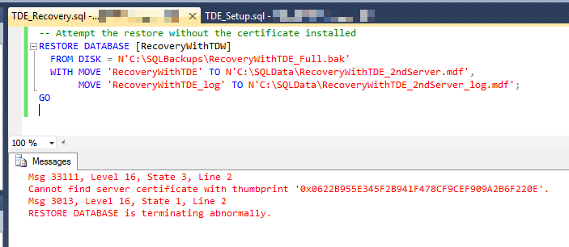
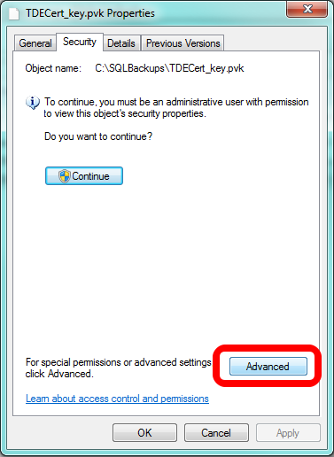
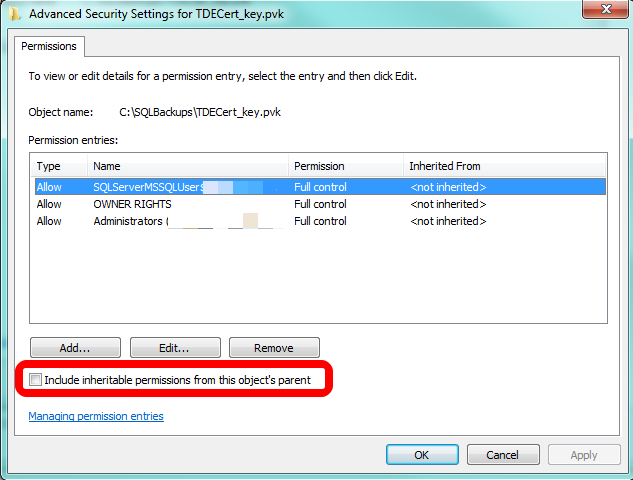
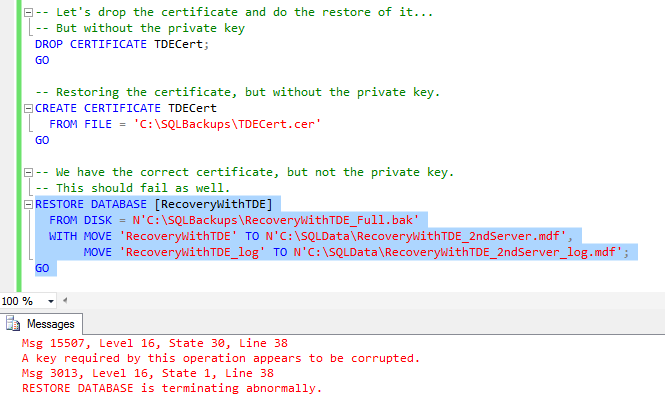
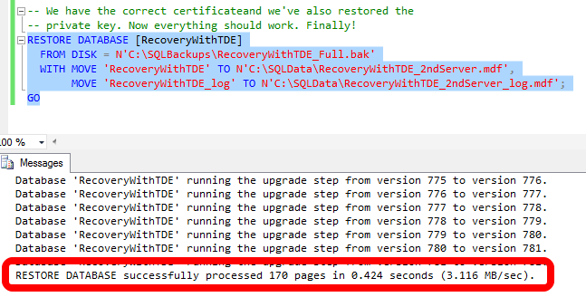

# SQL Server encryption testing

- Initiate database backup
- Failed Restore - No Key, No Certificate
- Failed Restore - The Same Certificate Name, But Not the Same Certificate
- Failed Restore - The Right Certificate, but Without the Private Key
- The Successful Restore


## Initiate database backup
```sql
USE [master];
GO 

-- Create the database master key
-- to encrypt the certificate
CREATE MASTER KEY
  ENCRYPTION BY PASSWORD = 'FirstServerPassw0rd!';
GO 

-- Create the certificate we're going to use for TDE
CREATE CERTIFICATE TDECert
  WITH SUBJECT = 'TDE Cert for Test';
GO 

-- Back up the certificate and its private key
-- Remember the password!
BACKUP CERTIFICATE TDECert
  TO FILE = N'C:\SQLBackups\TDECert.cer'
  WITH PRIVATE KEY ( 
    FILE = N'C:\SQLBackups\TDECert_key.pvk',
 ENCRYPTION BY PASSWORD = 'APrivateKeyP4ssw0rd!'
  );
GO

USE [hrms];
GO 

-- Create the DEK so we can turn on encryption
USE [RecoveryWithTDE];
GO 

CREATE DATABASE ENCRYPTION KEY
  WITH ALGORITHM = AES_256
  ENCRYPTION BY SERVER CERTIFICATE TDECert;
GO 

-- Exit out of the database. If we have an active 
-- connection, encryption won't complete.
USE [master];
GO 

-- Turn on TDE
ALTER DATABASE [hrms]
  SET ENCRYPTION ON;
GO 

```

This starts the encryption process on the database. Note the password specified for the database master key. As is implied, when we go to do the restore on the second server, we will going to use a different password. Having the same password is not required, but having the same certificate is.

Even on databases that are basically empty, it does take a few seconds to encrypt the database. Check the status of the encryption with the following query:

```sql
-- We're looking for encryption_state = 3
-- Query periodically until you see that state
-- It shouldn't take long
SELECT DB_Name(database_id) AS 'Database', encryption_state 
FROM sys.dm_database_encryption_keys;
```

As the comments indicate, we're looking for our database to show a state of 3, meaning the encryption is finished: 


When the encryption_state shows as 3, can take a backup of the database, because we'll need it for the restore to the second server:
```sql
-- Now backup the database so we can restore it
-- Onto a second server
BACKUP DATABASE [hrms]
TO DISK = N'C:\SQLBackups\RecoveryWithTDE_Full.bak';
GO 
```
Now that we have the backup, let's restore this backup to a different instance of SQL Server.

## Failed Restore - No Key, No Certificate

The first scenario for restoring a TDE protected database is the case where we try to do the restore and we have none of the encryption pieces in place. We don't have the database master key and we certainly don't have the certificate. This is why TDE is great. If you don't have these pieces, the restore simply won't work. Let's attempt the restore:
```sql
-- Attempt the restore without the certificate installed
RESTORE DATABASE [hrms]
  FROM DISK = N'C:\SQLBackups\RecoveryWithTDE_Full.bak'
  WITH MOVE 'RecoveryWithTDE' TO N'C:\SQLData\RecoveryWithTDE_2ndServer.mdf',
       MOVE 'RecoveryWithTDE_log' TO N'C:\SQLData\RecoveryWithTDE_2ndServer_log.mdf';
GO
```
This will fail. Here's what we see if attempt the restore:


When SQL Server attempts the restore, it recognizes it needs a certificate, a specific certificate at that. Since the certificate isn't present, the restore fails.

## Failed Restore - The Same Certificate Name, But Not the Same Certificate

The second scenario is where the database master key is present and there's a certificate with the same name as the first server (even the same subject), but it wasn't the certificate from the first server. Let's set that up and attempt the restore:
```sql
-- Let's create the database master key and a certificate with the same name
-- But not from the files. Note the difference in passwords
CREATE MASTER KEY
  ENCRYPTION BY PASSWORD = 'SecondServerPassw0rd!';
GO 

-- Though this certificate has the same name, the restore won't work
CREATE CERTIFICATE TDECert
  WITH SUBJECT = 'TDE Cert for Test';
GO 

-- Since we don't have the corrected certificate, this will fail, too.
RESTORE DATABASE [hrms]
  FROM DISK = N'C:\SQLBackups\RecoveryWithTDE_Full.bak'
  WITH MOVE 'RecoveryWithTDE' TO N'C:\SQLData\RecoveryWithTDE_2ndServer.mdf',
       MOVE 'RecoveryWithTDE_log' TO N'C:\SQLData\RecoveryWithTDE_2ndServer_log.mdf';
GO
```
Note the difference in the password for the database master key. It's different, but that's not the reason we'll fail with respect to the restore. It's the same problem as the previous case: we don't have the correct certificate. As a result, you'll get the same error as in the previous case.

## Failed Restore - The Right Certificate, but Without the Private Key

The next scenario is where you do accomplish the certificate restore, but you don't have the private key. This, too, will fail. However, before you attempt the T-SQL code, you may have to fix the file permissions on the certificate file and the private key file. This is likely if you are attempting to do the restore on a SQL Server instance that's on the same system as the first instance. To ensure your second instance can access the files, go to the location of the files and bring up the file properties (right-click on the file and then select Properties from the pop-up menu).

Click on the Security tab and then click on the Advanced button. When SQL Server wrote these files, it probably broke the inheritance of permissions, and we're going to fix that.



This brings up a different interface and you should be looking at the Permissions tab. If you see it, click on the Continue button. You'll see it if UAC is on


Now you'll turn on inheritance. Note what I've circled. If the box is unchecked, as it is in following image, that means inheritance is off. If that's the case with your file(s), click to check the box and click OK at every interface to turn inheritance back on.



Now let's try to recover the certificate, but intentionally forget to restore with the private key. Before we can create the certificate from the file, we'll have to drop the certificate we just created.
```sql
-- Let's drop the certificate and do the restore of it...
-- But without the private key
DROP CERTIFICATE TDECert;
GO 

-- Restoring the certificate, but without the private key.
CREATE CERTIFICATE TDECert
  FROM FILE = 'C:\SQLBackups\TDECert.cer'
GO

-- We have the correct certificate, but not the private key.
-- This should fail as well.
RESTORE DATABASE [hrms]
  FROM DISK = N'C:\SQLBackups\RecoveryWithTDE_Full.bak'
  WITH MOVE 'RecoveryWithTDE' TO N'C:\SQLData\RecoveryWithTDE_2ndServer.mdf',
       MOVE 'RecoveryWithTDE_log' TO N'C:\SQLData\RecoveryWithTDE_2ndServer_log.mdf';
GO
```
We have the right certificate, but without the private key, SQL Server can't use it to decrypt the database. As a result, we get a different error, telling us that there's a problem with the key. The error says the key appears to be corrupt, but we know the real issue: we didn't restore the key.



## The Successful Restore

In order to perform a successful restore, we'll need the database master key in the master database in place and we'll need to restore the certificate used to encrypt the database, but we'll need to make sure we restore it with the private key. In checklist form:

- There's a database master key in the master database.
- The certificate used to encrypt the database is restored along with its private key.
- The database is restored.
Since we have the database master key, let's do the final two steps. Of course, since we have to clean up the previous certificate, we'll have a drop certificate in the commands we issue:
```sql
-- Let's do this one more time. This time, with everything,
-- Including the private key.
DROP CERTIFICATE TDECert;
GO 

-- Restoring the certificate, but without the private key.
CREATE CERTIFICATE TDECert
  FROM FILE = 'C:\SQLBackups\TDECert.cer'
  WITH PRIVATE KEY ( 
    FILE = N'C:\SQLBackups\TDECert_key.pvk',
 DECRYPTION BY PASSWORD = 'APrivateKeyP4ssw0rd!'
  );
GO

-- We have the correct certificate and we've also restored the 
-- private key. Now everything should work. Finally!
RESTORE DATABASE [hrms]
  FROM DISK = N'C:\SQLBackups\RecoveryWithTDE_Full.bak'
  WITH MOVE 'RecoveryWithTDE' TO N'C:\SQLData\RecoveryWithTDE_2ndServer.mdf',
       MOVE 'RecoveryWithTDE_log' TO N'C:\SQLData\RecoveryWithTDE_2ndServer_log.mdf';
GO
```

With everything in place, restore successful:


